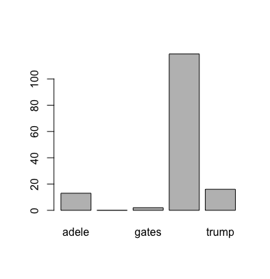

# Final Project

#### Gal Bar 200462133, Gal Steimberg 201253572

## Phase 1 - Data Collection

In this phase of the project we will gather the data needed for the rest of the final project. We will collect Facebook posts from public figures using the Facebook API in R. 

The process of phase 1 will be the following:
1. Collect the 1000 latest Facebook posts from several popular figures
2. Manipulate the data to fit our needs
3. Explore the data and manipulate it
4. Save the dataset to the disk


#### Fetching the data from Facebook

Here we wrote an R script that uses 'Rfacebook' package in order to access the Facebook API.

First we will set up the configuration that will allow us to access Facebook: 

```r
library(Rfacebook)
library(tm)
library(RCurl)
library(SnowballC)
library(wordcloud)

app_id <- "219932136741834182"
app_secret <- "1e8ad2627d91239702754e9487af039a571"
fb_oauth <- fbOAuth(app_id, app_secret)
access_token <- "EAADICANevcYBALERIpywyS123q2x3YZBNBU9Wr2jR4ZA8Vsh5aQTWtngZAsIZAMi8zFRroGCEVkJBI9ab1ZBpLws3KYrxQhnVZB4DDm6yML9vZCDHAb4HJZACgZAjUca67Jyl3t7klRQfNRUMuYp8oldMeLKzPZAhucyCXscZD"
```
* The ids shown above are fake ids and not the real ids we used (in order to refrain from privacy issues)


Now that we set up our credenentials we can move on to retrieving the data. We picked five different public figures and used the API to get their latest posts:

```r
#***cristiano***
cristiano_page <- getPage(page="Cristiano", token=access_token, n=100)
message <- cristiano_page$message

write.csv(message, file="cristiano.csv")
#***run graphs script here***

#***trump***
trump_page <- getPage(page="DonaldTrump", token=access_token, n=100)
message <- trump_page$message

write.csv(message, file="trump.csv")
#***run graphs script here***

#***adele***
adele_page <- getPage(page="adele", token=access_token, n=100)
message <- adele_page$message

write.csv(message, file="adele.csv")
#***run graphs script here***

#***hilary***
hillary_page <- getPage(page="hillaryclinton", token=access_token, n=100)
message <- hillary_page$message

write.csv(message, file="hillary.csv")
#***run graphs script here***

#***bill gates***
gates_page <- getPage(page="BillGates", token=access_token, n=100)
message <- gates_page$message

write.csv(message, file="gates.csv")
```
#### Data Cleaning

Now that we have the raw data we can move on to cleaning it a bit
The cleaning that we performed met the following criteria:

- Remove numbers
- Remove english common stopwords
- Remove punctuations
- Eliminate extra white spaces
- Text stemming
- Minor error fixing

```r

docs <- Corpus(VectorSource(message))

toSpace <- content_transformer(function(x,pattern) gsub(pattern, " ", x))
docs <- tm_map(docs, toSpace, "/")
docs <- tm_map(docs, toSpace, "@")
docs <- tm_map(docs, toSpace, "\\|")

#Remove numbers
docs <- tm_map(docs, removeNumbers)

#Remove english common stopwords
docs <- tm_map(docs, removeWords, stopwords("english"))

#Remove punctuations
docs <- tm_map(docs, removePunctuation)

#Eliminate extra white spaces
docs <- tm_map(docs, stripWhitespace)

#Text stemming
docs <- tm_map(docs, stemDocument)

#error fix
docs <- tm_map(docs, function(x) iconv(enc2utf8(x), sub = "byte"))

```

#### Dataframe Extractio and Data Exploration

Now we would like to explore the data that we have a bit more.
In total we have posts for five different figures, and our final goal is to build a predictor for a new post for each of these figures. Let's try and take a look at the popular words for each figure to get a high level understanding of the common words for each:

First we will count the words for each figure and post and then create a word could from it

```r
#Word counts
tdm <- TermDocumentMatrix(docs)
m <- as.matrix(tdm)
v <- sort(rowSums(m), decreasing=TRUE)
d <- data.frame(word=names(v), freq=v)
head(d, 10)

#Draw word cloud
wordcloud(words=d$word, freq=d$freq, min.freq=1, max.words=200, random.order=FALSE, rot.per=0.35, colors=brewer.pal(8, "Dark2"))
```

- Hillary:


- Trump:


- Adele


- Ronaldo


- Gates


Now that we have a sense we have a good sense of the most common words for each figure, lets translate the data into a graph and calculate some important features of it. We think that looking at the problem as a graph can help us visualize the data better and get to a better understanding of it. By calculating these feature we can have some sense on:

- The most important words
- Words appearing next to each
- Words usually coming together
- First impression of possible sentences
- Central words to each post and to each figure


First we need to decribe the data as an adjacency matrix:
```r
#Transform data into an adjacency matrix
#using this: https://rdatamining.wordpress.com/2012/05/17/an-example-of-social-network-analysis-with-r-using-package-igraph/

tdm <- TermDocumentMatrix(docs)
freq_terms <- findFreqTerms(tdm, lowfreq=10)
tdm <- tdm[freq_terms, ]
m <- as.matrix(tdm)
m[m >= 1] <- 1
tm <- m %*% t(m)

```

Now we can create graph for each figure using the following:
```r
#Create the graph
#build a graph from the above matrix
graph <- graph.adjacency(tm, weighted=T, mode="undirected")
#remove loops
graph <- simplify(graph)
#set labels and degrees of vertices
V(graph)$label <- V(graph)$name
V(graph)$degree <- degree(graph)
#design the graph
V(graph)$label.cex <- 2.2 * V(graph)$degree / max(V(graph)$degree)+ .2
V(graph)$label.color <- rgb(0, 0, .2, .8)
V(graph)$frame.color <- NA
egam <- (log(E(graph)$weight)+.4) / max(log(E(graph)$weight)+.4)
E(graph)$color <- rgb(.5, .5, 0, egam)
E(graph)$width <- egam

layout <- layout.fruchterman.reingold(graph)
plot(graph, layout=layout)
```

And here are the results:

- Hillary:


- Trump:


- Adele


- Ronaldo


- Gates


When taking a look at these graph it is interesting to see to how the there are common (central) words for all the figures on one hand, while on the other hand we see that there are some posts that have totaly different words with totaly different weights and importance.

Through these graphs we can understand the features of each figure and the words he uses together and their ordering as well.

Next we would like to calculate betweeness and closeness for each of these figures. Betweeness and closeness will help us understand better the importance of each word is in a standard post for each figure. So, when we can understand how much "impact" a specif word will have on our predictor.


```r
#betweenness
betweenness <- betweenness(graph, v=V(graph))
betweenness

#closeness
closeness <- closeness(graph, vids=V(graph))
closeness
```

The Edge Betweenness algorithm detects communities by progressively removing edges from the original network. The connected components of the remaining network are the communities. Instead of trying to construct a measure that tells us which edges are the most central to communities, the Edge Betweeness algorithm focuses on edges that are most likely "between" communities. 

We use it here to detect words close to each other or words which could possibly fit together in a post:

```r
#cluster edge betweenness
set.seed(1)
ceb <- cluster_edge_betweenness(graph)
ceb
plot(graph, vertex.color=membership(ceb))
```

- Hillary:


- Trump:


- Adele


- Ronaldo


- Gates


By observing these graph we can find some interesting results on our data. This information will help us in phase two by allowing us to traing a better classsifier.

## Phase 2 - Classifier Training

In this phase of the project we used several classifying algorithms and trained them with 80% of the data in order to predict the 20% left.

#### Importing data collected in phase 1

Here we are reading all the data that we collected in the previous phase from a csv file seperated into 3 columns defining id, content (text sequence) and figure (type of text sequence)

```r
library(tm)

#First install and load packages needed for text mining.

posts = read.csv("<path>/allPosts.csv", stringsAsFactors = F,row.names = 1)
```

#### Normalizing text

Now we will transform the data set into a corpus, normalize the text using a series of pre-processing steps:

- Switch to lower case
- Remove numbers
- Remove punctuation marks and stopwords
- Remove extra white spaces

```r-using-package-igraph/#To use the tm package we first transfrom the dataset to a corpus:
post_corpus = Corpus(VectorSource(posts$content))

post_corpus

#Next we normalize the texts in the post using a series of pre-processing steps
#Switch to lower case 
#Remove numbers
#Remove punctuation marks and stopwords
#Remove extra whitespaces
post_corpus = tm_map(post_corpus, content_transformer(tolower))
post_corpus = tm_map(post_corpus, removeNumbers)
post_corpus = tm_map(post_corpus, removePunctuation)
post_corpus = tm_map(post_corpus, removeWords, c("the", "and", stopwords("english")))
post_corpus = tm_map(post_corpus, stripWhitespace)
```

#### Analyzing the textual data

In order to analyze the textual data we use DTM representation. after creating a dtm from the corpus we will do a few manipulations and then split to training (80%) and testing (20%) sets.

```
#To analyze the textual data, we use a Document-Term Matrix (DTM) representation: 
post_dtm <- DocumentTermMatrix(post_corpus)
post_dtm

inspect(post_dtm[50:55, 50:55])

#To reduce the dimension of the DTM, we can remove the less frequent terms such that the sparsity is less than
#0.99
post_dtm = removeSparseTerms(post_dtm, 0.99)
post_dtm

post_dtm_tfidf <- DocumentTermMatrix(post_corpus, control = list(weighting = weightTfIdf))
post_dtm_tfidf = removeSparseTerms(post_dtm_tfidf, 0.95)

post_dtm_tfidf

#Let’s remove the actual texual content for statistical model building
posts$content = NULL
#Now we can combine the tf-idf matrix with the sentiment figure according to the sentiment lists.
posts = cbind(posts, as.matrix(post_dtm_tfidf))
posts$figure = as.factor(posts$figure)

#Split to testing and training set
id_train <- sample(nrow(posts),nrow(posts)*0.80)
posts.train = posts[id_train,]
posts.test = posts[-id_train,]
```

#### Evaluating performance

First we import the relevant libraries

```r
library(rpart)
library(rpart.plot)
library(e1071)
```

We ran a few different classifying algorithms. Each once seperated into 2 parts. first part, building the classifier using the training set. second part, predicting the type of the textual sequences from the testing set.

- SVM </br>
Given a set of training examples, each marked as belonging to one or the other of two categories, an SVM training algorithm builds a model that assigns new examples to one category or the other, making it a non-probabilistic binary linear classifier (although methods such as Platt scaling exist to use SVM in a probabilistic classification setting). An SVM model is a representation of the examples as points in space, mapped so that the examples of the separate categories are divided by a clear gap that is as wide as possible. New examples are then mapped into that same space and predicted to belong to a category based on on which side of the gap they fall.

```r
#svm
posts.svm = svm(figure~ ., data = posts.train);
pred.svm = predict(posts.svm, posts.test)
```

```r 
table(posts.test$figure,pred.svm,dnn=c("Obs","Pred"))
```


```r 
plot(pred.svm)
```


```r 
mean(ifelse(posts.test$figure != pred.svm, 1, 0))
```


- Random forest </br>
Random forests or random decision forests are an ensemble learning method for classification, regression and other tasks, that operate by constructing a multitude of decision trees at training time and outputting the class that is the mode of the classes (classification) or mean prediction (regression) of the individual trees. Random decision forests correct for decision trees' habit of overfitting to their training set.
```r
library(randomForest)
#random forest
posts.rf = randomForest(figure~ ., data = posts.train, importance=TRUE)
plot(posts.rf)
pred.rf= predict(posts.rf,posts.test)
```

```r 
table(posts.test$figure,pred.svm,dnn=c("Obs","Pred"))
```


```r 
plot(pred.rf)
```


```r 
mean(ifelse(posts.test$figure != pred.rf, 1, 0))
```


### Conclusion - SVM vs Random Forest </br>
For a classification problem Random Forest gives you probability of belonging to class. SVM gives you distance to the boundary, you still need to convert it to probability somehow if you need probability. For those problems, where SVM applies, it generally performs better than Random Forest. SVM gives you "support vectors", that is points in each class closest to the boundary between classes. They may be of interest by themselves for interpretation.
That explains the result where we can see: SVM predicted right ~52.5% while Random Forest predicted right only ~41.5%.

Loading more libraries
```r

# Load libraries
library(mlbench)
library(caret)
library(caretEnsemble)
```
#### Example of Boosting Algorithms

Boosting is a machine learning ensemble meta-algorithm for primarily reducing bias, and also variance in supervised learning, and a family of machine learning algorithms which convert weak learners to strong ones. Boosting is based on the question posed by Kearns and Valiant (1988, 1989) Can a set of weak learners create a single strong learner? A weak learner is defined to be a classifier which is only slightly correlated with the true classification (it can label examples better than random guessing). In contrast, a strong learner is a classifier that is arbitrarily well-correlated with the true classification.

```r 
# Example of Boosting Algorithms
control <- trainControl(method="repeatedcv", number=10, repeats=3)
seed <- 7
metric <- "Accuracy"
```

- C5.0

```r
# C5.0
set.seed(seed)
fit.c50 <- train(figure~ ., posts.train, method="C5.0", metric=metric, trControl=control)
plot(fit.c50)
```


- Stochastic Gradient Boosting

```r
# Stochastic Gradient Boosting
set.seed(seed)
fit.gbm <- train(figure~ ., posts.train, method="gbm", metric=metric, trControl=control, verbose=FALSE)
plot(fit.gbm)
```


- Boosting Algorithms Summary

```r
# summarize results
boosting_results <- resamples(list(c5.0=fit.c50, gbm=fit.gbm))
summary(boosting_results)
```


```r
dotplot(boosting_results)
```


#### Example of Bagging Algorithms

Bootstrap aggregating, also called bagging, is a machine learning ensemble meta-algorithm designed to improve the stability and accuracy of machine learning algorithms used in statistical classification and regression. It also reduces variance and helps to avoid overfitting. Although it is usually applied to decision tree methods, it can be used with any type of method. Bagging is a special case of the model averaging approach.

```r 
# Example of Bagging algorithms
control <- trainControl(method="repeatedcv", number=10, repeats=3)
seed <- 7
metric <- "Accuracy"
```

- Bagged CART

```r
# Bagged CART
set.seed(seed)
fit.treebag <- train(figure~ ., posts.train, method="treebag", metric=metric, trControl=control)
```

- Random Forest

```r
# Random Forest
set.seed(seed)
fit.rf <- train(figure~ ., posts.train, method="rf", metric=metric, trControl=control)
```

- Bagging Algorithms Summary

```r
# summarize results
bagging_results <- resamples(list(treebag=fit.treebag, rf=fit.rf))
summary(bagging_results)
```


```r
dotplot(bagging_results)
```


### Conclusion - Boosting vs Bagging </br>
In practice, boosting beats bagging in general, but either bagging and boosting will beat a plain classifier. This is shown in the paper Bagging, Boosting and C4.5 where the author makes comparisons between bagging, boosting and C4.5 over two dozens of datasets, and shows that boosting performs better in most cases.
This explains the results we see in the summarizing tables in which the boosting algorithms predicted the result slightly better than the bagging algorithms almost in every parameter.

</br>

##### Note: Algorithm descriptions and comparsions were referenced from: </br>
https://en.wikipedia.org/wiki/Main_Page</br>
 http://www.chioka.in/which-is-better-boosting-or-bagging/</br> 
 https://datascience.stackexchange.com/questions/6838/when-to-use-random-forest-over-svm-and-vice-versa


## Phase 3 - Text Sequence Generation

Deep learning can also be used for learning the sequences of a problem and then generating entirely new plausible sequences for the problem domain.

### Loading Data

```python
from keras.utils.data_utils import get_file
path = get_file('trump3.txt', origin="https://raw.githubusercontent.com/galst/FinalProject/master/data/trump-txt.txt")
text = open(path).read()
print('corpus length:', len(text))
```

Downloading data from https://raw.githubusercontent.com/galst/FinalProject/master/data/trump-txt.txt
16384/15434 [===============================] - 0s    
corpus length: 15434


Let's first examine this data, and recognize some issues to handle:
```python
text[0:20000]
```
```
'While I greatly appreciate the efforts of President Xi & China to help w/ North Korea, it has not worked out. At least I know China tried!\nThe Democrats don’t want you to know how much we’ve accomplished. While they do nothing but obstruct and distract, we continue to work hard on fulfilling our promises to YOU!\nBig day today. VOTE Handel (GA-6) and Norman (SC-5) for Congress. These two will be a tremendous help in our fight for lower taxes, stronger security, and great healthcare!\nThe U.S. once again condemns the brutality of the North Korean regime as we mourn its latest victim.\nGREAT job Ivanka Trump!\n"President Donald J. Trump\'s schedule for Tuesday, June 20th:\nDaily intelligence briefing\nMeeting with National Security Advisor H.R. McMaster (drop-in by Vice President Mike Pence and President Petro Poroshenko of Ukraine)\nLegislative Affairs lunch\nDinner with Vice President Mike Pence and Mrs. Karen Pence"\nMy heartfelt thoughts and prayers are with the 7 U.S. Navy sailors of the #USSFitzgerald and their families.\n"Melania and I offer our deepest condolences to the family of Otto Warmbier on his untimely passing.\nThere is nothing more tragic for a parent than to lose a child in the prime of life. Our thoughts and prayers are with Otto’s family and friends, and all who loved him. \nFull Statement: whitehouse.gov/the-press-office/2017/06/19/statement-president-donald-j-trump-passing-otto-warmbier"\nThank you Wyatt and Montana — two young Americans who aren’t afraid to stand up for what they believe in. Our movement to #MAGA is working because of great people like you!\nMelania and I were honored to welcome President Juan Carlos Varela and Mrs. Varela of Panama to the White House today.\nThe MAKE AMERICA GREAT AGAIN agenda is doing very well despite the distraction of the Fake News!\n"President Donald J. Trump\'s schedule for Monday, June 19th:\nDaily intelligence briefing\nWelcomes President Juan Carlos Varela and Mrs. Varela of Panama\nMeeting with President Varela\nWorking luncheon with President Varela\nAmerican Technology Council roundtable\nAmerican Technology Council reception"\nThis is the message I want every young American to hear: there is dignity in every honest job, and there is nobility in every honest worker.\nI am canceling the last administration’s completely one-sided deal with Cuba, and seeking a MUCH better deal for the Cuban people and for the United States of America.\nNow that I am President, America will expose the crimes of the Castro regime and stand with the Cuban people in their struggle for freedom.\nAmerica will always stand for liberty, and America will always pray and cheer for the freedom of the Cuban people.\nDespite the phony witch hunt going on in America, we are doing GREAT! Regulations way down, jobs and enthusiasm way up! #MAGA\nGreat news! #MAGA\n"Thank you Wisconsin! Tuesday was a great success for #WorkforceWeek at WCTC with Ivanka Trump and Governor Scott Walker. \nMore: 45.wh.gov/BXYooL"\nThe Fake News Media hates when I use what has turned out to be my very powerful Social Media - over 100 million people! I can go around them!\n"President Donald J. Trump\'s schedule for Friday, June 16th:\nTravels to Miami, FL\nGives remarks and participates in a signing on the United States’ policy towards Cuba\nReturns to Washington, D.C."\nWe are all united by our love of our GREAT and beautiful country.\n"Today we celebrate the dignity of work and the greatness of the American worker.\nExpanding Apprenticeships in America: http://bit.ly/2stwYia"\nYou are witnessing the single greatest WITCH HUNT in American political history — led by some very bad and conflicted people!  #MAGA\n"President Donald J. Trump\'s schedule for Thursday, June 15th:\nDaily intelligence briefing\nGovernors and Workforce of Tomorrow roundtable\nRemarks on the Apprenticeship and Workforce of Tomorrow initiatives\nSigns an Executive Order\nInvestiture Ceremony for Justice Neil Gorsuch"\nHonoring our great American flag and all for which it stands. #FlagDay\nHappy birthday to the U.S. Army and our soldiers. Thank you for your bravery, sacrifices, and dedication. Proud to be your Commander-in-Chief!\nMelania and I are grateful for the heroism of our first responders and praying for the swift recovery of all victims of this terrible shooting. Please take a moment today to cherish those you love, and always remember those who serve and keep us safe.\n"President Donald J. Trump\'s statement on the shooting incident in Virginia:\nThe Vice President and I are aware of the shooting incident in Virginia and are monitoring developments closely. We are deeply saddened by this tragedy. Our thoughts and prayers are with the members of Congress, their staffs, Capitol Police, first responders, and all others affected."\nCongressman Steve Scalise of Louisiana, a true friend and patriot, was badly injured but will fully recover. Our thoughts and prayers are with him.\n"President Donald J. Trump\'s schedule for Wednesday, June 14th:\nRemarks at the Apprenticeship Initiative kickoff\nSigns an Executive Order"\nThe passage of the U.S. Department of Veterans Affairs Accountability and Whistleblower Protection Act is GREAT news for veterans! I look forward to signing it!\n2 million more people just dropped out of ObamaCare. It’s totally broken. The Obstructionist Democrats gave up, but we’re going to have a real bill, not ObamaCare!\nThe Fake News Media has never been so wrong or so dirty. Purposely incorrect stories and phony sources to meet their agenda of hate. Sad!\nHeading to the Great State of Wisconsin to talk about JOBS, JOBS, JOBS! Big progress being made as the Real News is reporting.\nThe fake news MSM doesn\'t report the great economic news we\'ve had since Election Day. All of our hard work is kicking in and we\'re seeing big results!\n"President Donald J. Trump\'s schedule for Tuesday, June 13th:\nDaily intelligence briefing\nMeeting with National Security Advisor H.R. McMaster\nLunch with members of Congress\nTravels to Milwaukee, Wisconsin\nMeeting with Obamacare victims\nStatement on healthcare\nTours Waukesha County Technical College\nWorkforce development roundtable discussion\nRemarks at a Friends of Governor Scott Walker reception\nReturns to Washington, D.C."\nFinally held our first full Cabinet meeting today. With this great team, we can restore American prosperity and bring REAL CHANGE to Washington.\nOur miners are going back to work!\nWe will NEVER FORGET the victims who lost their lives one year ago today in the horrific #PulseNightClub shooting. #OrlandoUnitedDay\n"President Donald J. Trump\'s schedule for Monday, June 12th:\nReceives National Security Council briefing\nLeads Cabinet Meeting\nLunch with Vice President Mike Pence\nWelcomes the 2016 NCAA Football National Champions: The Clemson Tigers"\nThe process to build is painfully slow, costly, and time consuming. My administration will END these terrible delays once and for all!\nAmerica is going to build again — under budget, and ahead of schedule.\nGreat honor to welcome President Klaus Iohannis to The White House today.\nI was not elected to continue a failed system. I was elected to CHANGE IT.\nDespite so many false statements and lies, total and complete vindication...and WOW, Comey is a leaker!\nCongratulations to Jeb Hensarling & Republicans on successful House vote to repeal major parts of the 2010 Dodd-Frank financial law. GROWTH!\nOne million new jobs, historic increases in military spending, and a record reduction in illegal immigration (75%). AMERICA FIRST!\n"President Donald J. Trump\'s schedule for Friday, June 9th:\nReceives daily intelligence briefing\nRoads, Rails, and Regulatory Relief Roundtable\nDelivers remarks\nBilateral meeting with the President of Romania\nExpanded bilateral meeting with the President of Romania\nJoint press conference with the President of Romania"\nWe will not let other countries take advantage of the United States anymore. We are bringing back OUR jobs!\nWe are keeping our promises — reversing government overreach and returning power back to the people, the way the country started.\nFrom now on, we will follow a very simple rule — every day that I am President, we are going to make AMERICA FIRST.\nYou fought hard for me, and now I\'m fighting hard for all of YOU.\nOur government will once again CELEBRATE and PROTECT religious freedom.\nWe will REBUILD this country because that is how we will Make America Great Again!\n"President Donald J. Trump\'s schedule for Thursday, June 8th:\nRemarks at Faith and Freedom Coalition’s Road to Majority Conference\nHosts Infrastructure Summit with Governors and Mayors"\nIt is time to rebuild OUR country, to bring back OUR jobs, to restore OUR dreams, and yes, to put #AmericaFirst!\nThe American People deserve the best infrastructure in the world!\nObamacare is in a total death spiral. We must fix this big problem so Americans can finally have the health care that they deserve!\n"Happy birthday to Vice President Mike Pence! Let\'s make his first birthday in The White House a GREAT one by signing his card. \n>>> http://bit.ly/pence-card"\nGetting ready to leave for Cincinnati, in the GREAT STATE of OHIO, to meet with ObamaCare victims and talk Healthcare & also Infrastructure!\nI will be nominating Christopher A. Wray, a man of impeccable credentials, to be the new Director of the FBI. Details to follow.\n"President Donald J. Trump\'s schedule for Wednesday, June 7th:\nReceives daily intelligence briefing\nTravels to Cincinnati, Ohio\nMeets with Obamacare victims\nRemarks on infrastructure initiative \nReturns to Washington, D.C."\nAnnouncement of Air Traffic Control Initiative:\nDuring my recent trip to the Middle East I stated that there can no longer be funding of Radical Ideology...Perhaps this will be the beginning of the END to the horror of terrorism!\nToday we remember the courage and bravery of our troops that stormed the beaches of Normandy 73 years ago. #DDay\nThe FAKE mainstream media is working so hard trying to get me not to use Social Media. I will not stop bringing my message directly to YOU, the American People!\nBig meeting today with Republican leadership concerning Tax Cuts and Healthcare. We are all pushing hard - must get it right!\n"Our nation will move faster, fly higher, and soar proudly toward the next GREAT chapter of American aviation. \n>>> http://bit.ly/2rZNOWu"\n"President Donald J. Trump\'s schedule for Tuesday, June 6th:\nReceives daily intelligence briefing\nMeets with National Security Advisor H. R. McMaster\nMeets with House and Senate leadership\nSigns a bill\nDinner with Members of Congress"\nThat\'s right, we need a TRAVEL BAN for certain DANGEROUS countries, not some politically correct term that won\'t help us protect our people!\n"Today, I announced an Air Traffic Control Initiative to take American air travel into the future - finally!\n>>>http://45.wh.gov/pmRJsy"\nSecretary Shulkin\'s decision to modernize the U.S. Department of Veterans Affairs medical records system is one of the biggest wins for our VETERANS in decades. Our HEROES deserve the best!\n"We need the Travel Ban — not the watered down, politically correct version the Justice Department submitted to the Supreme Court, but a MUCH TOUGHER version!\nWe cannot rely on the MSM to get the facts to the people. Spread this message. SHARE NOW."\nWe will do everything in our power to assist the U.K. We send our thoughts and prayers, and we renew our resolve — stronger than ever before — to protect the United States and its allies. This bloodshed MUST END.\n"President Donald J. Trump\'s schedule for Monday, June 5th:\nReceives daily intelligence briefing\nAnnounces the Air Traffic Control Reform Initiative\nLunch with Vice President Mike Pence and Secretary of Education Betsy DeVos\nHosts a reception for Gold Star Families with First Lady Melania Trump"\nWe must stop being politically correct and get down to the business of security for our people. If we don\'t get smart it will only get worse.\nWhatever the United States can do to help out in London and the U. K., we will be there - WE ARE WITH YOU. GOD BLESS!\nWe need to be smart, vigilant and tough. We need the courts to give us back our rights. We need the Travel Ban as an extra level of safety!\nToday we reaffirmed our unbreakable support for the American HEROES who keep our streets, our homes, and our citizens safe.\nThrilled to be back in the U.S. after our first foreign trip — one that was full of historic and unprecedented achievements.\nI was elected to represent the citizens of Pittsburgh, not Paris —  so we’re getting out of the Paris Accord, and we’re making America GREAT again!\nIt is time to exit the Paris Accord and time to pursue a new deal that PROTECTS the environment, our companies, our citizens, and our COUNTRY. #AmericaFirst\n"President Donald J. Trump\'s schedule for Friday, June 2nd:\nReceives daily intelligence briefing\nMeets with Senator Lindsey Graham\nSigns bills"\nIn order to fulfill my solemn duty to protect America and its citizens, the United States will withdraw from the one-sided Paris Climate Accord. We will no longer be robbed at the expense of the American worker. We are putting America FIRST!\nI will be announcing my decision on the Paris Accord, today at 3:00 P.M. in the White House Rose Garden. MAKE AMERICA GREAT AGAIN!\nThe big story is the "unmasking and surveillance" of people that took place during the Obama Administration.\n"President Donald J. Trump\'s schedule for Thursday, June 1st:\nReceives daily intelligence briefing\nMeets with National Security Advisor H. R. McMaster\nStatement regarding the Paris Accord"\nIt was an honor to welcome the Prime Minister of Vietnam, Nguy<U+1EC5>n Xuân Phúc to The White House this afternoon.\nWe traveled the world to strengthen long-standing alliances, and to form new partnerships. See more at: http://45.wh.gov/tnmVr7\nHopefully Republican Senators, good people all, can quickly get together and pass a new (repeal & replace) HEALTHCARE bill. Add saved $\'s.\nI will be announcing my decision on the Paris Accord over the next few days. MAKE AMERICA GREAT AGAIN!\nKathy Griffin should be ashamed of herself. My children, especially my 11 year old son, Barron, are having a hard time with this. Sick!\nSo now it is reported that the Democrats, who have excoriated Carter Page about Russia, don\'t want him to testify. He blows away their case against him & now wants to clear his name by showing "the false or misleading testimony by James Comey, John Brennan..." Witch Hunt!\n"President Donald J. Trump\'s schedule for Wednesday, May 31st:\nReceives daily intelligence briefing\nMeets with Secretary of State Rex Tillerson\nWelcomes Prime Minister Nguyen Xuan Phuc of Vietnam\nMeets with Nguyen Xuan Phuc\nExpanded bilateral meeting with Prime Minister Nguyen Xuan Phuc"\n"Buy American and hire American. Make sure your #MAGA hat isn\'t FAKE by watching how our hats are 100% #MadeInTheUSA!\nGet the authentic hat today: shop.donaldjtrump.com/collections/headwear"\nThe U.S. Senate should switch to 51 votes, immediately, and get Healthcare and TAX CUTS approved, fast and easy. Dems would do it, no doubt!\nRussian officials must be laughing at the U.S. & how a lame excuse for why the Dems lost the election has taken over the Fake News.\nWe have a MASSIVE trade deficit with Germany, plus they pay FAR LESS than they should on NATO & military. Very bad for U.S. This will change.\nWe honor the noblest among us -- the men and women who paid the ultimate price for victory and for freedom.'
```

### Preprocessing the text to fit into a network
Most words in our text will only appear one or two times. It’s a good idea to remove these infrequent words. Having a huge vocabulary will make our model slow to train, and because we don’t have a lot of contextual examples for such words we wouldn’t be able to learn how to use them correctly anyway. That’s quite similar to how humans learn. To really understand how to appropriately use a word you need to have seen it in different contexts. In our code we limit our vocabulary to the vocabulary_size most common words (which was set to 600, mainly for memory limitations).
We replace all words not included in our vocabulary by UNKNOWN_TOKEN.

```python
vocabulary_size = 600
unknown_token = "UNKNOWNTOKEN"
```

We also want to learn which words tend start and end a sentence. To do this we prepend a special SENTENCE_START token, and append a special SENTENCE_END token to each sentence.


```python
sentence_start_token = "SENTENCESTART"
sentence_end_token = "SENTENCEEND"
```

There some meaning to things like separators. In order for these patterns to be preserved, let's convert it to speciel tokens, otherwise it will be removed from the text with the rest of the punctuations.
```python
separator= "SEPARATOR"
text1 = text.replace('\n', ' ')
text1 = text1.replace('--',' '+ separator + ' ')
text1 = text1.replace('.',' '+sentence_end_token +' '+ sentence_start_token+' ' )
```

We have some text preprocessing functions in keras preprocessing.text module. text_to_word_sequence splits a sentence into a list of words. In this task we model the language as a sequence of words, so we use this function to split the entire text to a list of words, in its original order.

```python
from keras.preprocessing.text import text_to_word_sequence
text2 = text_to_word_sequence(text1, lower=False, split=" ") #using only 10000 first words
text2[0:100]
```
```
['While',
 'I',
 'greatly',
 'appreciate',
 'the',
 'efforts',
 'of',
 'President',
 'Xi',
 'China',
 'to',
 'help',
 'w',
 'North',
 'Korea',
 'it',
 'has',
 'not',
 'worked',
 'out',
 'SENTENCEEND',
 'SENTENCESTART',
 'At',
 'least',
 'I',
 'know',
 'China',
 'tried',
 'The',
 'Democrats',
 'don’t',
 'want',
 'you',
 'to',
 'know',
 'how',
 'much',
 'we’ve',
 'accomplished',
 'SENTENCEEND',
 'SENTENCESTART',
 'While',
 'they',
 'do',
 'nothing',
 'but',
 'obstruct',
 'and',
 'distract',
 'we',
 'continue',
 'to',
 'work',
 'hard',
 'on',
 'fulfilling',
 'our',
 'promises',
 'to',
 'YOU',
 'Big',
 'day',
 'today',
 'SENTENCEEND',
 'SENTENCESTART',
 'VOTE',
 'Handel',
 'GA',
 '6',
 'and',
 'Norman',
 'SC',
 '5',
 'for',
 'Congress',
 'SENTENCEEND',
 'SENTENCESTART',
 'These',
 'two',
 'will',
 'be',
 'a',
 'tremendous',
 'help',
 'in',
 'our',
 'fight',
 'for',
 'lower',
 'taxes',
 'stronger',
 'security',
 'and',
 'great',
 'healthcare',
 'The',
 'U',
 'SENTENCEEND',
 'SENTENCESTART',
 'S']
 ```
 
Tokenizer is a class for vectorizing texts, or/and turning texts into sequences (=list of word indexes, where the word of rank i in the dataset (starting at 1) has index i). It considers the vocabulary size (nb_words) for indexing most frequent words, otherwise using the unknown-token index.

```python
from keras.preprocessing.text import Tokenizer
token = Tokenizer(num_words=600,char_level=False)
token.fit_on_texts(text2)
```

We represent each word as a one-hot vector of size vocabulary_size. Each word will become a vector, and the input will be a matrix, with each row representing a word.
texts_to_matrix performs this conversion for us when setting the mode parameter to 'binary'.

```python
text_mtx = token.texts_to_matrix(text2, mode='binary')
text_mtx.shape
```
(2902, 600)

### Input & Output
```python
input_ = text_mtx[:-1]
output_ = text_mtx[1:]
```
Making sure that they both have the same number of rows:
```python
input_.shape, output_.shape
```
((2901, 600), (2901, 600))

### Create and train model
```python
from keras.preprocessing import sequence
from keras.models import Sequential
from keras.layers.core import Dense, Activation, Flatten
from keras.layers.wrappers import TimeDistributed
from keras.layers.embeddings import Embedding
from keras.layers.recurrent import LSTM
```

Turn positive integers (indexes) into dense vectors of fixed size. This layer can only be used as the first layer in a model.
```python
model = Sequential()
model.add(Embedding(input_dim=input_.shape[1],output_dim= 42, input_length=input_.shape[1]))
```

Connect it to a dense output layer, by first flattening the result, and then passing it to the output layer, and then train the model:

```python
model.add(Flatten())
model.add(Dense(output_.shape[1], activation='sigmoid'))

model.compile(loss='categorical_crossentropy', optimizer='rmsprop',metrics=["accuracy"])
model.fit(input_, y=output_, batch_size=300, epochs=10, verbose=1, validation_split=0.2)
```

```
Train on 2320 samples, validate on 581 samples
Epoch 1/10
2320/2320 [==============================] - 5s - loss: 5.7183 - acc: 0.0112 - val_loss: 4.2990 - val_acc: 0.0086
Epoch 2/10
2320/2320 [==============================] - 4s - loss: 5.2992 - acc: 0.0362 - val_loss: 4.2388 - val_acc: 0.0499
Epoch 3/10
2320/2320 [==============================] - 4s - loss: 5.2088 - acc: 0.0431 - val_loss: 4.2266 - val_acc: 0.0499
Epoch 4/10
2320/2320 [==============================] - 4s - loss: 5.1529 - acc: 0.0431 - val_loss: 4.2374 - val_acc: 0.0499
Epoch 5/10
2320/2320 [==============================] - 5s - loss: 5.1151 - acc: 0.0431 - val_loss: 4.1933 - val_acc: 0.0499
Epoch 6/10
2320/2320 [==============================] - 4s - loss: 5.0782 - acc: 0.0431 - val_loss: 4.2048 - val_acc: 0.0499
Epoch 7/10
2320/2320 [==============================] - 6s - loss: 5.0582 - acc: 0.0431 - val_loss: 4.2005 - val_acc: 0.0499
Epoch 8/10
2320/2320 [==============================] - 6s - loss: 5.0229 - acc: 0.0431 - val_loss: 4.1965 - val_acc: 0.0499
Epoch 9/10
2320/2320 [==============================] - 6s - loss: 4.9949 - acc: 0.0431 - val_loss: 4.2167 - val_acc: 0.0499
Epoch 10/10
2320/2320 [==============================] - 6s - loss: 4.9741 - acc: 0.0513 - val_loss: 4.2140 - val_acc: 0.0551


<keras.callbacks.History at 0x18210efa860>
```
### Check the Model
Let's define a function that accepts a word, convert it to its one-hot representation, predict the following word using the trained model, and finally convert the predicted one-hot result into a text and returns it.

```python
import numpy as np
def get_next(text,token,model,fullmtx,fullText):
    tmp = text_to_word_sequence(text, lower=False, split=" ")
    tmp = token.texts_to_matrix(tmp, mode='binary')
    p = model.predict(tmp)
    best10 = p.argsort() [0][-10:]
    bestMatch = np.random.choice(best10,1)[0]
    next_idx = np.min(np.where(fullmtx[:,bestMatch]>0))
    return fullText[next_idx]
    
import random
text3 = ''
for x in range(0, 30):
    currWord = random.choice(text2)
    while currWord == unknown_token or currWord == sentence_start_token or currWord == sentence_end_token or currWord == separator:
        currWord = random.choice(text2)
    text3 = text3 + currWord
    for y in range(0, 20):
        nextWord = get_next(currWord,token,model,text_mtx,text2)
        if nextWord == sentence_start_token or nextWord == sentence_end_token:
            text3 = text3 + ' ' + sentence_end_token + ' ' + sentence_start_token + ' '
        else:
            text3 = text3 + ' ' + nextWord
        currWord = nextWord
        if y == 19:
            text3 = text3 + '.\n'
text3
```

```
"OUR to we and our and we will we of we will SENTENCEEND SENTENCESTART  and we we our the SENTENCEEND SENTENCESTART  we a.\nTrump's of to to of SENTENCEEND SENTENCESTART  the our to and and our we of the and President Donald in the our.\nRoad and SENTENCEEND SENTENCESTART  we the SENTENCEEND SENTENCESTART  SENTENCEEND SENTENCESTART  the our SENTENCEEND SENTENCESTART  SENTENCEEND SENTENCESTART  to in to SENTENCEEND SENTENCESTART  SENTENCEEND SENTENCESTART  the the to in SENTENCEEND SENTENCESTART .\nGermany to a to a the SENTENCEEND SENTENCESTART  the we will to the President we of to of and President we and.\ndedication we SENTENCEEND SENTENCESTART  and the and and a to the and SENTENCEEND SENTENCESTART  the we will we of and to SENTENCEEND SENTENCESTART  to.\nWorkforce of SENTENCEEND SENTENCESTART  President the President of our the President a and of we of and to our we a to.\nto of and we the and of our a a of the to to SENTENCEEND SENTENCESTART  a the SENTENCEEND SENTENCESTART  our SENTENCEEND SENTENCESTART  a.\nof to of SENTENCEEND SENTENCESTART  our SENTENCEEND SENTENCESTART  and SENTENCEEND SENTENCESTART  SENTENCEEND SENTENCESTART  the President Donald to SENTENCEEND SENTENCESTART  SENTENCEEND SENTENCESTART  to SENTENCEEND SENTENCESTART  the the the our.\nshooting SENTENCEEND SENTENCESTART  and our a in of President SENTENCEEND SENTENCESTART  of SENTENCEEND SENTENCESTART  to in the a to SENTENCEEND SENTENCESTART  of a and we.\nday SENTENCEEND SENTENCESTART  our SENTENCEEND SENTENCESTART  and to the the President SENTENCEEND SENTENCESTART  and of of the President SENTENCEEND SENTENCESTART  SENTENCEEND SENTENCESTART  we of of we.\nwill in in SENTENCEEND SENTENCESTART  SENTENCEEND SENTENCESTART  the our we and SENTENCEEND SENTENCESTART  we the SENTENCEEND SENTENCESTART  the of to we to SENTENCEEND SENTENCESTART  SENTENCEEND SENTENCESTART  SENTENCEEND SENTENCESTART .\nthe SENTENCEEND SENTENCESTART  SENTENCEEND SENTENCESTART  of our and the SENTENCEEND SENTENCESTART  of President of the President a to and SENTENCEEND SENTENCESTART  a a SENTENCEEND SENTENCESTART  we.\n6 a SENTENCEEND SENTENCESTART  to in a the President SENTENCEEND SENTENCESTART  in a SENTENCEEND SENTENCESTART  and our in SENTENCEEND SENTENCESTART  SENTENCEEND SENTENCESTART  a and the to.\npaid SENTENCEEND SENTENCESTART  we will SENTENCEEND SENTENCESTART  and SENTENCEEND SENTENCESTART  our our SENTENCEEND SENTENCESTART  of our the SENTENCEEND SENTENCESTART  the the President Donald a a our.\nof of to we our we of of the of SENTENCEEND SENTENCESTART  President we SENTENCEEND SENTENCESTART  a of a SENTENCEEND SENTENCESTART  in to our.\nAmerica we SENTENCEEND SENTENCESTART  the SENTENCEEND SENTENCESTART  we to in the President our the of the and the a of of SENTENCEEND SENTENCESTART  we.\nthe SENTENCEEND SENTENCESTART  of our a of we of to our to of we we of we SENTENCEEND SENTENCESTART  to our a SENTENCEEND SENTENCESTART .\nand and our our to SENTENCEEND SENTENCESTART  of the SENTENCEEND SENTENCESTART  and and a the and to a our the we to of.\ncountry of we we will our to our the the President SENTENCEEND SENTENCESTART  we we to the of our we will and.\nReceives and the SENTENCEEND SENTENCESTART  to to and SENTENCEEND SENTENCESTART  our and our SENTENCEEND SENTENCESTART  SENTENCEEND SENTENCESTART  and SENTENCEEND SENTENCESTART  a our SENTENCEEND SENTENCESTART  to in the.\nwill we to to and SENTENCEEND SENTENCESTART  President we the we SENTENCEEND SENTENCESTART  to and a the to our to we the to.\nNCAA we a SENTENCEEND SENTENCESTART  SENTENCEEND SENTENCESTART  of SENTENCEEND SENTENCESTART  and and of SENTENCEEND SENTENCESTART  the our in we our of to the SENTENCEEND SENTENCESTART  of.\nyou SENTENCEEND SENTENCESTART  we our we we SENTENCEEND SENTENCESTART  in in SENTENCEEND SENTENCESTART  a the we to we the we will to SENTENCEEND SENTENCESTART  and.\nsure a to and to of the SENTENCEEND SENTENCESTART  SENTENCEEND SENTENCESTART  a in to SENTENCEEND SENTENCESTART  we and a and the to the President.\nthe to a our our our the our and President SENTENCEEND SENTENCESTART  a a of SENTENCEEND SENTENCESTART  to SENTENCEEND SENTENCESTART  a SENTENCEEND SENTENCESTART  and SENTENCEEND SENTENCESTART .\nCongress and and and a SENTENCEEND SENTENCESTART  a to in the and and the and SENTENCEEND SENTENCESTART  SENTENCEEND SENTENCESTART  SENTENCEEND SENTENCESTART  our a SENTENCEEND SENTENCESTART  in.\nMike in we to to a we our the SENTENCEEND SENTENCESTART  our our our we of our we to SENTENCEEND SENTENCESTART  a and.\ndoing and SENTENCEEND SENTENCESTART  SENTENCEEND SENTENCESTART  in SENTENCEEND SENTENCESTART  we and SENTENCEEND SENTENCESTART  we SENTENCEEND SENTENCESTART  a the the we of a to of to our.\nRegulations in and SENTENCEEND SENTENCESTART  SENTENCEEND SENTENCESTART  to of of we and to we the SENTENCEEND SENTENCESTART  in the a of our to SENTENCEEND SENTENCESTART .\nform of we will the and we of to in we SENTENCEEND SENTENCESTART  SENTENCEEND SENTENCESTART  of and a a of SENTENCEEND SENTENCESTART  of President.\n"
```

Let replace our special markers:

```python
text3 = text3.replace(' '+ separator + ' ','--')
text3 = text3.replace(' ' +sentence_end_token +' '+ sentence_start_token + ' ', '.')
text3
```

Now lets save our output posts to the disk:
(All input and output files can be found in this repository)

```
new_path = 'C:/src/Academy/final/FinalProject/data/trump-output-txt.txt'
new_file = open(new_path,'w')
new_file.write(text3)
new_file.close()
```

## Phase 4 - Classifying The Posts

In this phase we will classify our posts using some of the classifiers that we built in the previous phases:

- SVM
- Random Forest
- C5.0 and Stochastic Gradient Boosting (Boosting Algorithms)

Our train set will be the original posts that we crawled Facebook to get. Our test set will be the output of Phase 3 - the newly generated posts.
For each classifier we will show its results.


### SVM

```
         Pred
Obs       adele clinton gates ronaldo trump
  adele      13       0     1      11     0
  clinton     0       0     0      18     5
  gates       3       0     1      25     2
  ronaldo     2       0     0      46     0
  trump       1       0     3      13     6
> 
> mean(ifelse(posts.test$figure != pred.svm, 1, 0))
[1] 0.56
```


### Random Forest

```
         Pred
Obs       adele clinton gates ronaldo trump
  adele      13       0     1      11     0
  clinton     0       0     0      18     5
  gates       3       0     1      25     2
  ronaldo     2       0     0      46     0
  trump       1       0     3      13     6

```



### C5.0 and Stochastic Gradient Boosting


```
Models: c5.0, gbm 
Number of resamples: 30 

Accuracy 
       Min. 1st Qu. Median   Mean 3rd Qu.   Max. NA's
c5.0 0.4355  0.4918 0.5081 0.5063  0.5246 0.6129    0
gbm  0.3710  0.4781 0.5161 0.5073  0.5331 0.5968    0

Kappa 
       Min. 1st Qu. Median   Mean 3rd Qu.   Max. NA's
c5.0 0.1570  0.2423 0.2661 0.2707  0.2936 0.4505    0
gbm  0.1014  0.2450 0.2879 0.2837  0.3230 0.4327    0

```
